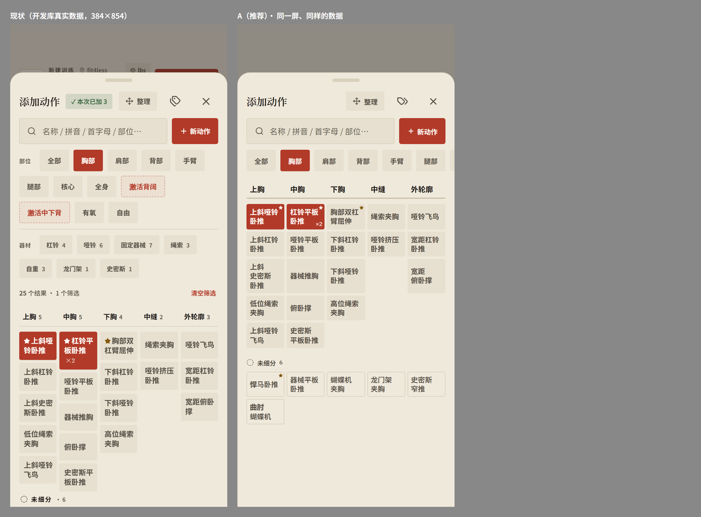
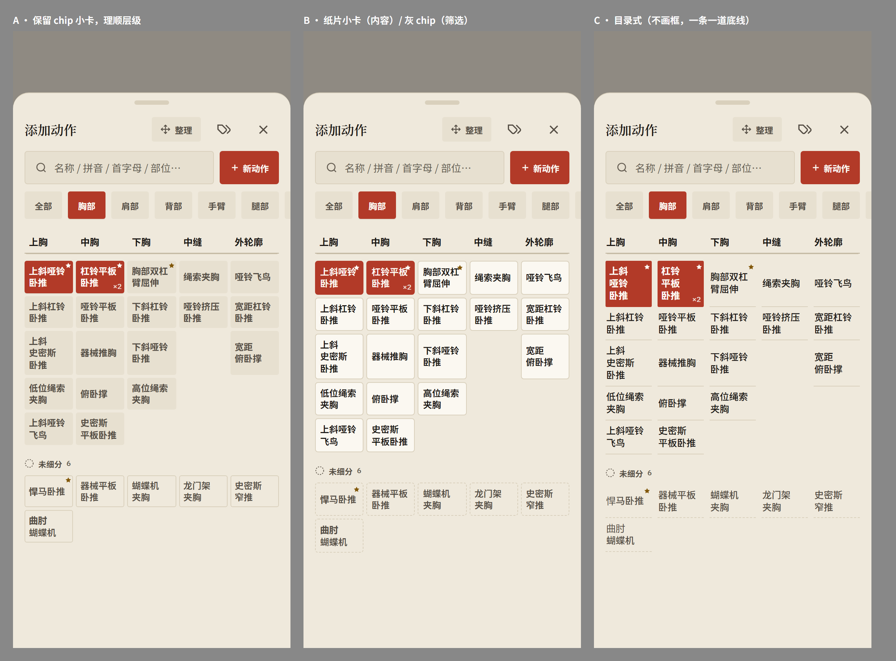
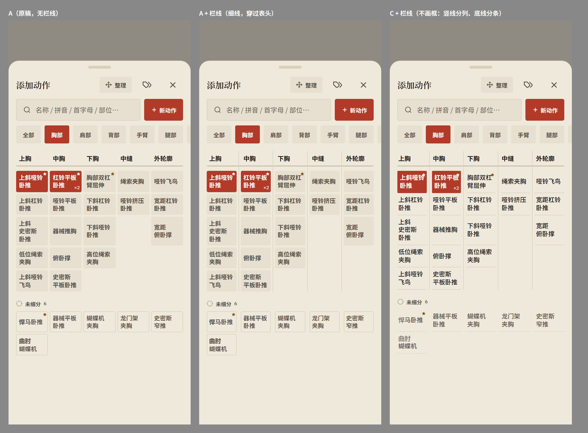

# fitlog 全面审查（2026-10-06）

> 只读审查，没改任何代码。明细（每条的文件:行号、证据、核验修正、各维度方案原文）见
> [audit-2026-10-06-details.md](audit-2026-10-06-details.md)；细分界面的草图在 [audit-2026-10-06/](audit-2026-10-06/)。

## 结论先说

- **你点名的三件都有现成方案**，各有几处要你拍板（见第五节）：
  细分界面乱的根因有三个，推荐「方向 A」并加上你提的列间竖线（栏线）；「整理」可以原地扩成动作库的唯一编辑入口，标签图标并进去；
  首选项建议在「我的」页加一行入口，第一批 6 项训练参数（±步长、递减降幅 kg / lbs 分开等）。
- **额外查到一批会让数据错、或者每天都碰到的问题**，最要紧的 3 条：
  1. 破纪录印章的数字是 kg，后面却写着 lbs，你每次破纪录看到的都是错的；
  2. 练到一半按「←」（或 App 被系统回收、刷新），这场训练就接不回工作台了，再点 FAB 会新开一场，下次加同样的动作底稿还会变成空的 0×0；
  3. 编辑旧训练时改动会立刻写库，返回时点「放弃」其实什么都没放弃；结束编辑还会把那场的结束时间改成现在。
- 原始结论 237 条（9 路审查 + 核验时补的），合并重复后约 150 条。全部过了一轮对抗核验，没有被整条推翻的，
  但有 30 条被修正了细节或严重度，这份报告用的都是修正后的说法。

## 怎么查的

- **9 路并行审查**：添加动作弹层交互、编辑功能盘点、细分界面视觉、训练录入、时间线/统计/计划、首选项盘点、数据同步正确性、全 App 排版一致性，再加一路按「真实的一天」从头走到尾。
  除了视觉那一路，每一路后面都跟一个核验者逐条去推翻它的结论。
- **实机走查**：本机隔离开发库，数据是你真实数据的拷贝（42 场训练 / 691 组 / 47 个自建动作），384 宽、真实触摸。
  对外请求全部掐掉，对开发库的写入也拦住了，NAS 和生产数据都没碰。
- **没覆盖到**：真机。手感、震动、键盘顶起、安卓返回键、长按后会不会补发点击，这几样只能在手机上确认（第四节）。

---

## 一、你点名的三件

### 1. 细分界面：为什么「乱、没有主次」

**根因有三个**：

1. **一屏只有一种灰块。** 部位/器材 chip 和动作小卡是同一种灰底粗体（这是 10-06 你选的「小卡跟 chip 同一套」），而筛选区占了 412px（约半屏），格子只露出 3 行。
   朱砂也多半落在筛选区：新动作、选中的部位、两个虚线自建部位、「清空筛选」。
2. **格子不像格子。** 名字一个字一个字地断行（「上斜史密 / 斯卧推」「宽距俯卧 / 撑」），星号还要占一个字的位置；
   每列各排各的，一张卡多一行，整列就往下错（相邻两列同一行错开 17px），底下还拖出一条锯齿。
3. **主次倒过来了。** 表头 12px，比卡片上的名字（12.86px）还小；「未细分」用的是 65px 高的白底大行，比格子还重（手臂那一屏是 304px 的格子，下面再接 12 条白卡，约 900px）。
   同一屏里「已添加」有两种长相：格子里是朱砂实底，未细分里是绿色「✓ 已添加」。

**三个方向**（草图用的是真实令牌、真实字体、你的胸部数据）：

| | 做法 | 好处 | 代价 |
|---|---|---|---|
| **A（推荐）** | 小卡保持 chip 样子；筛选区收成一行；表头 13px 加动作卡刊头那条双线；格子改成行对齐的 grid；名字按词断行；未细分改成同宽小卡托盘、比格子轻一档 | 守住你 10-06 定的「chip 同款」，一眼还是这个 App | 筛选 chip 和小卡还是同一种灰块，只是隔开了；深色下灰块的边界很弱 |
| B | 同 A，只把小卡换成纸片（白底加细边，也就是动作行的窄版） | 控件和内容一眼就分开，深色下边界清楚 | **推翻「chip 同款」**；25 个描边小框挤在 5 列里，略密 |
| C | 不画框，一条一道底线，像目录 | 最安静 | 第一版 demo 被嫌丑的原因之一就是画成了表格；点按范围不明确 |

A 的整理态、深色和 360 宽见 [sk-A-states.png](audit-2026-10-06/sk-A-states.png)：整理时小卡「浮起来」变成纸片，表示可以拿起来挪，不加图标，也不加说明文字。

**加栏线（你 10-06 审阅时提出：真正要区分的是列，每列是一个细分）**

**同意，建议并进方向 A**：

- **为什么合适**
  - 这一屏的结构本来就是「5 个栏目」，列是第一层级。栏线把这一点直接画出来，比只靠 4px 的空隙去暗示清楚得多。
  - 报纸分栏的那条竖线，本来就是印刷品语言，和「训练月刊」的比喻是一套。
  - 深色模式收益最大：灰块和底色几乎分不出边界（亮度比 1.04:1），有了栏线，结构一下就立住了（见 [sk-rules-states.png](audit-2026-10-06/sk-rules-states.png) 中图）。
- **要注意的几点**
  - **用细线、淡色**（`divider` 色，1px）。用深色 `rule-strong` 的话，配上灰块就成了笼子 / 表格，第一版 demo 被嫌丑就有「画成表格」的原因。
  - **列间距从 4px 加到 9px**，竖线放在正中，每张卡因此窄约 4px。384 宽仍然一行 4 个字；**360 宽会掉成一行 2–3 个字**（右图），要么 360 下间距收到 7px，要么字号降到 12px。
  - **栏线从表头穿到格子底就停**。「未细分」托盘不画栏线：它不属于任何一列，没有栏线正好表示「还没归位」。
  - **拖动时整列高亮**，范围就是两条栏线之间，比现在的整列描边干净。
- 右图是「目录式 C + 栏线」：不画框，竖线分列、底线分条，很像报纸版面，也是可行的方向；代价和 C 一样，点按范围不明显。

**不管选哪个方向都要做的**：

- **名字按词断行**：用一张健身词表（上斜 / 哑铃 / 卧推…）切词，配合 `keep-all`。浏览器自带的分词实测会切出「卧|推」，不能用。
- **行对齐**：「×2」改成右下角的角标，不再单独占一行。
- **英文**：5 列在英文下怎么排都放不下（「Dumbb/ell」），英文改成宽列横滑。
- **细分超过 5 个时的横滑**：表头现在不吸顶，列宽从 66px 一下跳到 118px，卡片上横划也划不动。要修。
- **收藏**：格子里没法收藏，长按菜单里加星。

### 2. 「整理」改成动作库的统一入口

**现状有多乱**：编辑入口有 4 套（弹层长按菜单、整理、标签图标→标签管理、计划页「从动作库选」里的「管理」）。几个典型：

- **删动作**：3 个入口 3 套保险。长按菜单删是「确认 + 撤销」；从「编辑标签」里删，没有撤销；计划页删，同一个确认框连弹两次。
- **细分**：新建 / 改名 / 删除 / 恢复散在整理、标签管理、编辑标签 3 处，长成 3 个样子；左右移又只有整理里有。
- **进了整理反而改不了动作**：点卡片没反应，长按松手也不出菜单，想改名得先退出整理。
- **「整理」常常找不到**：只在有细分的部位出现，在全部 / 有氧 / 自建部位 / 搜索下都没有。
- **备注、记录项、练法**：只能在今天训练的动作卡 ⋯ 里改，动作库里改不了。
- **删掉的内置动作找不回来**：「编辑标签」里还写着「可在『设置 → 重置』中恢复」，可那里只有「重置账户」，清空的是全部数据；被删的名字还会一直占着，想新建同名动作会被拒。

**推荐方案：整理 = 添加动作弹层的编辑态（不新开页面）**

- **一条规则**：普通态「点 = 添加，长按 = 快捷」；整理态「点 = 编辑，按住 = 拖」。
  整理态里点卡片本来就不添加，这个手势正好空出来给编辑用。
- **头部**：去掉标签图标，「整理」常驻（任何视图都在）；进整理后头部只剩「整理 · 胸部 [完成]」。
- **整理态从上到下**：
  1. 部位行：一行横滑，末尾是「未分部位 N · 已删除 N · ＋」，N 为 0 时不显示。点已选中的部位打开部位面板（改名 / 删除）。
  2. 当前部位的细分格：表头末尾加一个虚线「＋」，点表头出面板（改名 / 左右移 / 按默认排序 / 删除）。
  3. 「已删除」托盘：点一下就恢复。
  4. 最底下是器材节。
- **动作面板**：由现在的长按菜单扩出来，长按和整理态点卡共用这一个面板。
  内容：名字（点了就改名）+ ★；归到细分；部位与器材（加上训练类型）；练法；备注；记录项；从动作库删除（先执行 + 撤销，不弹确认）。
- **入口数量**：4 套收成 1 套，头部按钮从 3 个减到 2 个。新面板只多一种（部位 / 器材面板），照搬现有细分表头面板的样子。
- **备选**：独立的「动作库」全屏页。空间大，但细分编辑又会分成两处，还会和弹层形成平行的第二套动作库，不推荐。

### 3. 首选项

**入口**：「我的」页加一行「首选项 ›」，打开整页高的底部弹层（和添加动作同一种）。
这一行右侧显示当前值摘要（「±5 lbs · 递减 −5 · 中文」），这是状态，不是教学文字。
「我的」页底部的设置卡，以及埋在时间线最底下的备份卡，都搬进去；顶栏切单位的按钮保留。

**第一批内容**：

| 组 | 项 | 控件 | 默认 | 跟谁走 |
|---|---|---|---|---|
| 训练 | 重量单位 | kg / lbs（和顶栏同一个状态） | — | 数据 |
| | 加减步长 · kg | 1 / 2.5 / 5 / 10 | 5 | 数据 |
| | 加减步长 · lbs | 2.5 / 5 / 10 | 5 | 数据 |
| | 递减每档 · kg | 2.5 / 5 / 10 | 5 | 数据 |
| | 递减每档 · lbs | 5 / 10 / 15 | 5 | 数据 |
| | 滑动手感 | 细 / 中 / 粗（每档 14 / 10 / 7 px） | 中 | 设备 |
| 动作 | 有氧默认记录 | 时长 / 距离 / 速度 / 次数 多选 | 时长 + 距离 | 数据 |
| | 距离单位 | km / mi（从重量单位上拆开） | km | 数据 |
| | 动作库与标签 › | 跳到「整理」 | | |
| 显示 | 外观 / 动效 / 语言 / 每周从周一或周日开始 | 分段 | 现值 | 外观、动效跟设备；语言、周起始日跟数据 |
| 设备 | 振动 | 开 / 关 | 开 | 设备 |
| 数据 | 同步状态、导出 / 导入 / 撤销导入、重置账户（放最后） | | | |

- **kg 和 lbs 为什么分开**：开发库里，国内场次的步进多是 5 / 10 kg，fit4less 器械是 10 lb、绳索是 5.5 lb。5 kg 和 5 lb 的手感差一倍多。
- **不进首选项的**：长按时长、取整规则、PR 阈值、撤销条时长、磁吸强度等，理由逐条写在明细里。
- **就地修改（第二步，要先出 demo）**：长按 ±5 那一条，原地换成一排步长让你点选；在单个动作的设置里覆盖全局值（绳索 5.5 lb 这种情况）。

**做之前要先修两处底座**，不然新设置也会中招：

1. **切单位 / 语言会被同步翻回去**：切的时候不打时间戳、不推送，下次同步拿远端的旧值盖回来（实测复现）。
2. **头像原图以 base64 存了两份**（约 210 万字符），占掉 localStorage 约四成；换一张大点的照片就会写满，之后各种设置会静默写失败。

**存储**：交接文档里「不新增 prefs key」那条约束不适合首选项。原因是 `customTags` / `exerciseOverrides` 共用一个时间戳整块比较：在手机上改一次步长，电脑那边的标签改动就会被盖掉。
建议只新增**一个** `appPrefs` 对象，自带时间戳，以后的首选项全放进去。要改的四处，以及一条防漏单测的写法，见明细。

---

## 二、额外查到、最该先修的

按「数据会不会错」和「每天碰不碰得到」排序。括号里是明细里的 id。

### 会让数据错的

1. **破纪录印章 kg 标成 lbs**（`pr-stamp-kg-labeled-lbs`）
   - 现象：卧推从 185 推到 200 lb，印章写的是「83.9 → 90.7 lbs」。总容量换算了，PR 的数没换算。
   - 位置：`WorkoutColophon.tsx:174-178`、`useWorkoutMutations.ts:274`。
2. **练到一半离开，就接不回工作台**（`workbench-not-restored`）
   - 现象：按「←」看一眼 PR、App 被系统回收、刷新，这三种情况下，工作台每次启动都是空的。FAB 只会新开一场，「继续」提示只认已结束的场次。
   - 想接着练：只能从时间线长按「编辑这次训练」进去。但那是编辑模式，不判 PR、一进去就亮「未保存」，结束时还会改掉结束时间。
   - 连带：放弃的那场会以「N 动作 0 组」留在时间线里，计入累计次数和连续天数；下次加同样的动作，底稿会变成空的 0×0（`abandoned-session-blanks-prefill`）。
   - 安卓返回键：App 没装 `@capacitor/app`，返回键 / 返回手势大概率直接把 App 退到桌面，会把这条放大（待真机确认）。
3. **编辑旧训练**（`edit-history-cannot-discard`、`edit-resets-finishedAt-resume-prompt`）
   - 每改一下都立刻写库，返回时的「有未保存的修改，确定要返回吗？」点了确定，改动其实还在。
   - 「结束训练」会把那场的 finishedAt 改成现在：期号 Vol +1、仪式再放一遍；10 分钟内点 FAB，会问要不要「继续」那场旧训练，选了就把今天的记录记进旧日期。
4. **日期选择器打开时停在 App 启动那一刻**（`datepicker-stale-initial`）
   - 现象：改旧训练的时间，只调了分钟就点确定，训练就被挪到今天。PR 历史里改动作时间也是这样。
   - 位置：`DateTimePicker.tsx:25-29`，`useState` 只在挂载时取一次初值。
5. **「添加组」把上一组的递减档一起抄过来**（`addset-clones-drop-set`）：点了组号，没做过的递减也入册，容量被抬高。
6. **删整场训练不写墓碑**（`workout-delete-no-tombstone`）：离线删的那场，推送没送到的话，下次拉取会原样回来。训练是唯一一种删除不写墓碑的实体。
7. **「从动作库删除」再撤销，历史会换主人**（`name-index-order-dependent`）：撤销把自建动作插回列表最前面，名字解析按先后顺序认，「悍马卧推」的 5 场历史、PR、收藏、备注就全被认成「曲肘蝴蝶机」的。
8. **删掉训练里唯一的动作，那场还留在库里**（`remove-last-exercise-not-persisted`）：时间线上会多一场「1 动作 1 组」。
9. **从细分格点「新动作」，不带当前部位**（`new-ex-no-part-prefill`）
   - 不选部位就确定，建出来的动作在任何部位里都找不到。你真实数据里的「器械上斜推胸」就是这么来的。
   - 在有氧里新建，类型默认还是「力量」；类型的默认值读的其实是计划页动作库残留的选择。
10. **离线时的删除和导入**（`prefs-deleted-keys-resurrect`、`import-merged-by-sync`）：清空的备注、删掉的标签改名，推送没送到时会被拉回来；联着同步导入备份，重载时的拉取会把服务器数据又合并回来，「整个替换」并不成立。
11. **围度和目标**（`measure-edit-leaks-into-add`、`goal-weight-autoupdate-kg`）：编辑一条围度后取消，再点「添加」打开的仍是「修改记录」，保存会覆盖旧数据；记体重会把 kg 数写进 lbs 目标的当前值（显示成 `82.55390951728643 / 175 lbs`）。

### 显示 / 统计不对

- **组号全是 1**：时间线展开和 PR 历史里，每一组都显示「1」（`Dashboard.tsx:84-98` 写死了 `setIdx={0}`）。
- **热力图按 UTC 归日**：多伦多晚上 8 点以后练的，算到第二天；连续天数也跟着错。
- **首页体重「+9.0 lbs · 30天」**：实际是和第一条体重比，不是和 30 天前比。
- **自重动作永远破不了 PR**：PR 列表里引体、悬垂举腿全显示「0.0 LBS」；65 条 PR 没有搜索，找一个动作要滑 3080px。
- **距离 / 速度**：单位绑在 kg/lbs 开关上，切换时只换标签不换数值，5 km 直接变成「5 mi」。
- **有氧默认记录项**：有氧动作加进来默认是「重量 × 次数」，还露出 ±5 lbs。别一刀切：你的划船机是按重量记的，要按历史判断。
- **英文模式**：中文下改过名的自建动作，英文名没跟着改，出现两个「悍马卧推」，点错会记到另一个动作名下。
- **删掉自建部位后**：用过它的动作，部位标签显示原始 id「CT_1783310847626」。

### 每天都会碰到的手感问题

- **±5 那一行会跳**：点完一组，±5 立刻移到下一组下面，整排下移 53px。紧接着连点下一组的组号，会按到「−5」。
- **±5 跟不上「下一组」**：
  - 一次加 4 个动作，书签和 ±5 落在最后一个动作上，页面也滚到最后一张卡；
  - 做完一个动作的最后一组后，下一个动作的第 1 组没有 ±5。
- **休息书签挡住组号**：书签的透明热区盖住了下一组组号的上半截，点偏上一点就白点。
- **改数要先删**：点有底稿值的格子再打字，是接在旧值后面（8 → 89），得先删掉旧值；回车也不会跳到下一格。
- **改了第 1 组，后面不跟**：第 1 组改了重量，下面的底稿行不跟着变；±5 加减的是底稿值，不是刚做完那组的值。
- **「● 未保存」名不副实**：它其实表示「有数据」，和「已自动保存」自相矛盾；第一组描实时它冒出来，整页还会往下跳 21px。
- **动作卡上的时间「12:13」**：点开的是第 1 组的「设置时长」，确定以后，结束时会误报「1 组改过但没点完成」。
- **撤销按钮太小**：只有 48×28，旁边 12px 就是 × 关闭，手上有汗时容易点到 ×。

---

## 三、其余问题（按区域，一行一条，详情见明细）

**添加动作弹层**
- 筛选区固定占半屏；你最常练的背部动作都在「未细分」里，被一大块内置格子压在下面。
- 整理把筛选行收起来了，但器材筛选仍然生效，格子只剩一部分，界面上看不出原因。
- 长按普通行时，提示文字被行的 overflow 裁掉；未细分行的进度线画到了弹层最底边。
- 搜拼音（如 `sxyl`）也出「没找到？创建」，点了真会建一个叫 `sxyl` 的动作。
- 已添加的卡再点一下，会再加一张同名卡（×2），没有撤销。
- 拖过一次的列从此一直是手动排序，回不到「收藏 → 最近」的自动排序。
- 整理里改细分名，没按回车直接点「完成」，新名字会丢。
- 标签、细分、部位都能建出同名的。
- 加到 10 个以上，头部折行（「整/理」竖排）。
- 误点了部位印没有退路，标题已经被写成那个部位。

**训练页**
- 结束确认框的文案在编辑模式下不对。
- 刊末页容量带「.0」。
- 每个带递减的组都常驻一行朱砂「+ 再加一档递减」。
- 英文下拖休息书签，浮签是中文。
- 长按排序时，自动滚动区被吸顶栏和底栏盖住。
- 练法建议 chip 点一下就永久新建练法。
- 「竭」字未选中时对比度只有 1.7:1。
- 吸顶栏半透明，滚动时下面的数字会透上来。

**时间线 / 统计 / 计划 / 目标**
- 计划：
  - 「安排训练」加到 3–4 个动作，保存按钮就到了屏外，存不了；
  - 目标重量没换算（lbs 下填 135，底稿成了 297.62）；
  - 从计划开练，底稿不用上次的重量；
  - 用的是另一套旧的全屏动作库，一次只能选一个；
  - 从计划开练后又放弃，之后结束的任意一场都会被标成「按计划」。
- 「并入上一场」不限时间（10/3 的腿可以并进 9/30 的背）。
- 时间线、PR 历史用的是大号账本行，一场展开 3760px。
- 时间线长按菜单固定往下展开，靠下的卡片被底栏盖住。
- 减重目标一创建进度条就是满的；目标卡显示英文原值「strength」。
- 目标、围度记录一点垃圾桶就删，没有确认，也没有撤销。
- 体重图把最重的那天标成「最好」。
- 记体重不预填上次的值，也不能补记昨天的。
- 切底栏不复位滚动。

**全 App 一致性**
- 分组小标题至少有五种长相，其中几种给中文加了字距（违反规格）。
- 弹窗家族没收拢（标题约定、底部按钮、底部面板各有几种）。
- 「添加」入口至少六种长相。
- 重量的写法不统一（LBS / lbs、551lbs、1.1k、105.0 / 105）。
- 日期格式有五六种。
- 周起始日有两套：热力图和时间线从周一开始，计划和日期选择器从周日开始。
- 新动作 / 编辑标签弹窗里，未选中的 chip 没有底色，看上去像一排散字。
- 卡片菜单叫「动作设置」，打开后标题是「维度设置」。

**候选删除的常驻说明文字**（只列，删不删你圈）
- 「· 单选」「· 多选」「· 数字为使用数」×3
- 空训练页的「点击下方「添加动作」开始记录」
- 「选择要记录的维度」
- 「继续刚才那场」弹窗里那一整段解释
- 「不断挑战你的极限。」「你的数据，始终属于你。」
- 动效三档下的说明小字（代码注释说是按实测反馈加的，删前问一下）

讲后果和状态的那些，比如导入会覆盖数据、「可撤销」、结束确认里的当前单位，核验后判定应该保留，没列进来。

**死代码 / 杂项**
- `useUserSettings.ts` 没人用。
- 有几处注释还写着「删组要长按 400ms」，实际已经改成单击删除 + 撤销。
- 真实数据里混着一条 E2E 残留计划「E2E_PLAN_1779439703540」。
- 自建「山羊挺身」和内置动作同名，没有「合并动作」的功能。

---

## 四、需要真机确认的

1. **长按松手那一下会不会点中刚弹出的菜单**：模拟触摸里必现，松手直接打开「编辑标签」或「重命名」。真机上安卓长按后一般不再补发点击，很可能是模拟环境的假象，但项目自己的 e2e 用的也是同一种模拟。
2. **安卓返回键 / 返回手势**：App 没装 `@capacitor/app`，大概率直接把 App 退到后台，而不是关掉弹层。
3. **键盘弹出后**，底部「添加动作」栏还占不占地方，账本还剩几行可见。
4. **数字字体**：截图里的数字大多落成了系统等宽字，主要是开发模式的加载时序造成的，打包版应该没这个问题。也就是说，这次凡是根据「数字长相」下的视觉判断都不可靠。

## 五、要你拍板的

> **2026-10-06 已拍板**：
> - 细分界面按「A + 栏线」做；
> - 普通态**不再**长按拖到细分，长按只出动作面板，所有整理的事都放进整理态（整理是低频需求）；
> - 计划页挑动作**换成**训练页同一个弹层（删掉旧全屏动作库和它的「管理」模式）；
> - ±步长、递减降幅 **kg 和 lbs 共用一个数**（首选项里各只有一行）。
>
> 下面是当时列的原题，留作记录。

**细分界面**
1. 选 A / B / C。推荐「A + 栏线」；选 B 等于推翻 10-06 定的「小卡跟 chip 同一套」。
2. 选了部位进来时，部位和器材筛选默认收成一行。这会改掉部位 chip 现在「铺开」的样子。
3. 正常态的表头去掉数字计数（整理态再显示）。

**整理**
4. 普通态还保不保留「长按满之后拖到细分」：
   - 保留：随手就能改；
   - 去掉：长按只出动作面板，拖动只在整理里，手势更单纯。
5. 整理态的部位行：一行横滑，还是照现在换行铺开。
6. 计划页选动作要不要这次一起换成同一个弹层（顺带解决它一次只能选一个、保存按钮出屏）。
7. 自建部位「激活背阔 / 激活中下背」各只有 1 个动作，要不要转成背部下的细分。

**首选项**
8. 入口放「我的」页一行 + 弹层（推荐），还是直接在「我的」页里展开。
9. kg 和 lbs 的步长、递减分开设（推荐），还是共用一个数。
10. 「长按 ±5 就地改步长」要不要做（要的话先出 demo）。

**修 bug 的顺序**：建议先修第二节「会让数据错的」1–8 条。它们互相独立、改动小，可以和上面三件新功能并行。

---

## 附：这次审查用到的东西

- 开发库：`node scripts/dev-with-local-db.mjs --reset`（3100 端口，种子是 `fitlog-backups/prod-snapshot-2026-10-06.json`）。审查期间对它的写入全部被拦截，数据保持种子原样。
- 走查辅助脚本和各路的截图在会话临时目录里，没有放进仓库；四张细分草图拷到了 `docs/audit-2026-10-06/`。
